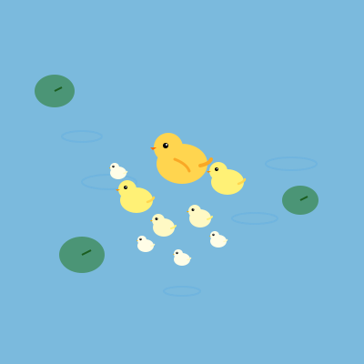

<p align="center">
  
</p>

# Pondkeeper - DuckDB Kubernetes Operator

Pondkeeper is a Kubernetes Operator for orchestrating DuckDB instances.

## Prerequisites

- [Docker](https://docs.docker.com/get-docker/)
- [kubectl](https://kubernetes.io/docs/tasks/tools/)
- [Kubernetes Cluster](https://kubernetes.io/docs/setup/)
- [make](https://www.gnu.org/software/make/manual/make.html)
- [controller-gen](https://github.com/kubernetes-sigs/controller-tools) (for code generation, if you want to rebuild CRDs)

## Quickstart

### 1. Clone the repository

```bash
git clone https://github.com/nimakhoshini/pondkeeper.git
cd pondkeeper
```

### 2. Build the controller

```bash
make docker-build IMG=<your-repo>/pondkeeper:latest
```

### 3. Push the image (if using a remote cluster)

```bash
docker push <your-repo>/pondkeeper:latest
```

### 4. Install CRDs

Apply the CustomResourceDefinitions (CRDs) to your cluster:

```bash
# If using kustomize:
make install

# Or manually (after code-gen)
kubectl apply -f config/crd/bases/
```

### 5. Deploy the Operator

Edit the image in `config/manager/manager.yaml` to match your built image (if needed):

```yaml
        image: <your-repo>/pondkeeper:latest
```

Then deploy:

```bash
# If using kustomize:
make deploy

# Or manually:
kubectl apply -f config/default/
```

### 6. Create a DuckDB Instance

Make a sample `DuckDB` resource (save as `duckdb.yaml`):

```yaml
apiVersion: database.pondkeeper.io/v1alpha1
kind: DuckDB
metadata:
  name: my-duckdb
spec:
  replicas: 1
```

Apply it:

```bash
kubectl apply -f duckdb.yaml
```

### 7. Verify

Check the deployment and pods:

```bash
kubectl get duckdb
kubectl get deployments
kubectl get pods
```

## Development

- Format code: `make fmt`
- Run tests: `make test`

## Cleanup

To uninstall CRDs and the operator:

```bash
make undeploy
make uninstall
```

## License

[Apache 2.0](LICENSE)

